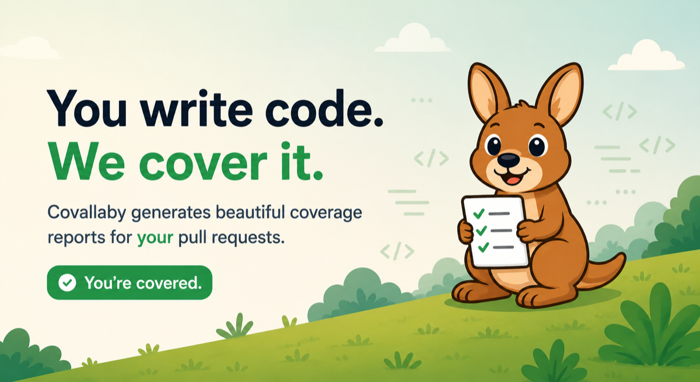

<p align="center">
  
</p>

<p align="center">
  <a href="https://covallaby.com"><b>covallaby.com</b></a> &nbsp;·&nbsp;
  <a href="https://covallaby.com/demo/">Live demo</a> &nbsp;·&nbsp;
  <a href="https://github.com/covallaby/action/actions/workflows/ci.yml"></a> &nbsp;·&nbsp;
  <a href="https://app.covallaby.com/r/covallaby/action"></a>
</p>

**Beautiful coverage reports for your pull requests.** No account, no upload
token, no dashboard you didn't ask for — one workflow step, and every PR
answers the only question that matters: *can I merge this?*

> ## 🦘 Covallaby
>
> You're covered.
>
> | Metric | Result |
> |---|---|
> | Project coverage | 91.4% |
> | Patch coverage | 96.8% |
> | Required | patch 85.0% |
>
> Nice jump! Every changed line that can be tested, is. 🎉

## Install

The fastest way — paste this into your coding agent (Claude Code, Cursor,
Copilot…) and it wires everything up for your stack, coverage file included:

```text
Read https://raw.githubusercontent.com/covallaby/action/main/llms-install.md and set up Covallaby in this repository.
```

Or from a terminal with Claude Code:

```bash
curl -fsSL https://raw.githubusercontent.com/covallaby/action/main/llms-install.md | claude
```

[`llms-install.md`](llms-install.md) walks the agent through producing a
coverage file for your stack, wiring the workflow, and verifying the result.
Prefer doing it by hand? Keep reading.

## Quick start

```yaml
name: Tests

on:
  pull_request:

permissions:
  contents: read
  pull-requests: write # sticky comment
  statuses: write # covallaby/project + covallaby/patch checks
  checks: write # the "Covallaby" Checks-tab entry

jobs:
  test:
    runs-on: ubuntu-latest
    steps:
      - uses: actions/checkout@v4
      - run: npm test -- --coverage # anything that writes a coverage file
      - uses: covallaby/action@main
        with:
          files: coverage/lcov.info
          min-patch: 85
```

That's the whole setup. Every PR then gets:

- **One sticky comment** — updated in place on every push, never spamming the
  thread, with collapsed per-file and per-directory breakdowns.
- **Named checks** — `covallaby/patch — 96.8% (target 85.0%)` and
  `covallaby/project` in the checks list, individually requirable in branch
  protection.
- **A "Covallaby" entry in the Checks tab** — the full report as its own page.
- **Diff annotations** — warning boxes directly on untested changed lines in
  the Files-changed view.
- **A CI gate** — failures explain what to do next
  (*"Patch coverage is 72.0%, but 85.0% is required. 4 changed lines aren't
  covered yet — start with `src/payment.ts:44-45`"*), never just
  "coverage failed."

See it live: [a passing PR](https://github.com/covallaby/action/pull/1) ·
[a failing PR](https://github.com/covallaby/action/pull/2) ·
[a docs-only PR](https://github.com/covallaby/action/pull/3).

## Producing a coverage file

Covallaby reads what your test runner writes — LCOV, JaCoCo XML, Cobertura
XML, and xccov JSON, auto-detected from content.

<details>
<summary><strong>Vitest / Jest</strong> (LCOV)</summary>

```bash
# Vitest (needs @vitest/coverage-v8)
vitest run --coverage --coverage.reporter=lcov
# Jest
jest --coverage
```

→ `files: coverage/lcov.info`
</details>

<details>
<summary><strong>Python — pytest</strong> (Cobertura)</summary>

```bash
pytest --cov --cov-report=xml   # needs pytest-cov
```

→ `files: coverage.xml`
</details>

<details>
<summary><strong>Java / Kotlin — JaCoCo</strong> (XML)</summary>

Gradle — apply the `jacoco` plugin and enable the XML report:

```groovy
jacocoTestReport { reports { xml.required = true } }
```

```bash
./gradlew test jacocoTestReport
```

→ `files: build/reports/jacoco/test/jacocoTestReport.xml`

Maven — configure `jacoco-maven-plugin` (`prepare-agent` + `report`), then
`mvn verify` → `files: target/site/jacoco/jacoco.xml`
</details>

<details>
<summary><strong>.NET — coverlet</strong> (Cobertura)</summary>

```bash
dotnet test --collect:"XPlat Code Coverage"
```

→ `files: TestResults/**/coverage.cobertura.xml` (glob the GUID directory)
</details>

<details>
<summary><strong>Swift — Xcode xccov</strong> (JSON)</summary>

```bash
xcodebuild test -scheme MyApp -enableCodeCoverage YES -resultBundlePath Result.xcresult
xcrun xccov view --archive --json Result.xcresult > coverage.json
```

→ `files: coverage.json`
</details>

<details>
<summary><strong>Go</strong> (via gcov2lcov)</summary>

Go's coverprofile isn't ingested natively yet
([convert with gcov2lcov](https://github.com/jandelgado/gcov2lcov)):

```bash
go test -coverprofile=coverage.out ./...
gcov2lcov -infile=coverage.out -outfile=coverage.lcov
```

→ `files: coverage.lcov`
</details>

Multiple files merge automatically (test shards, mixed suites):
`files: shard-1/lcov.info, shard-2/lcov.info`.

## Inputs

| Input | Description | Default |
|---|---|---|
| `files` | Coverage files, comma/newline separated. Optional for visual-artifact-only uploads. | — |
| `min-patch` | Min coverage % of the lines changed in the PR. | off |
| `min-project` | Min project line coverage %. | off |
| `min-new-file` | Min coverage % for each file added in the PR. | off |
| `comment` | `update` (one sticky comment) or `off`. | `update` |
| `breakdown` | Directory rollup: `auto`, a fixed depth, or `off`. | `auto` |

<details>
<summary>All inputs</summary>

| Input | Description | Default |
|---|---|---|
| `format` | Force a parser: `lcov`, `jacoco`, `cobertura`, `xccov`. | auto-detect |
| `strip-prefix` | Path prefix stripped so paths are repo-relative. | workspace |
| `check` | The rich "Covallaby" Checks-tab entry. | `true` |
| `annotations` | Warnings on uncovered changed lines in the diff. | `true` |
| `statuses` | `covallaby/project` + `covallaby/patch` commit statuses. | `true` |
| `github-token` | Token for comments/checks/statuses. | `github.token` |
| `server-url` | Covallaby server used for hosted coverage, browser runs, and Storybook previews. | off |
| `server-token` | Per-repo or admin upload token for that server. When both server inputs are set, coverage files are stored in the hosted dashboard. | off |
| `storybook-capture` | Capture each story from `index.json` as an image: `auto`, `required`, or `off`. | `auto` |
| `playwright-results` | Playwright JSON reporter output; enables browser playbacks. | off |
| `playwright-artifacts` | Extra files/directories such as `test-results`. | off |

</details>

Outputs: `project-coverage`, `patch-coverage`, `uncovered-lines`, `ok`.

## Playwright videos, screenshots, and traces

Covallaby can turn CI's Playwright output into a visual playback page. Keep the
JSON reporter alongside your preferred reporter:

```ts
// playwright.config.ts
export default defineConfig({
  reporter: [["json", { outputFile: "playwright-results.json" }], ["html"]],
  use: { video: "on", trace: "retain-on-failure", screenshot: "only-on-failure" },
});
```

Then extend the normal Action step. If this job does not produce coverage,
omit `files`; Covallaby will publish a focused visual-testing report without
creating fake or empty coverage metrics:

```yaml
- uses: covallaby/action@main
  if: always() # preserve the recording when Playwright fails
  with:
    server-url: https://app.covallaby.com
    server-token: ${{ secrets.COVALLABY_TOKEN }}
    playwright-results: playwright-results.json
    playwright-artifacts: test-results
```

The Action posts a playback link in the Step Summary and exposes it as
`playback-url`. Videos and traces upload directly to private object storage via
short-lived signed URLs; the Action does not send them through the app server.
Keep `if: always()` on this step: without it, GitHub skips the upload after a
failed browser test, which is precisely when the recording and trace are most
useful. Covallaby still fails clearly if the expected JSON report was never
created.

## Storybook previews

Build Storybook in CI, then point the same Action step at its static output:

```yaml
- run: npm run build-storybook
- uses: covallaby/action@main
  if: always()
  with:
    server-url: https://app.covallaby.com
    server-token: ${{ secrets.COVALLABY_TOKEN }}
    storybook-dir: storybook-static
```

Covallaby uploads the files directly to private object storage and adds an
isolated, interactive Storybook preview to its sticky PR comment, Step Summary,
and dashboard. The server must configure a separate `COVALLABY_PREVIEW_BASE_URL`
origin so repository-controlled preview code never runs with dashboard access.

## CLI

Everything works locally too:

```bash
covallaby report coverage/lcov.info          # friendly summary (--json for machines)
covallaby check coverage/lcov.info --min-project 85
covallaby html coverage/lcov.info -o report  # one-file HTML report: dark mode, search
covallaby badge coverage/lcov.info -o coverage-badge.svg
covallaby validate coverage/lcov.info        # does this file parse?
```

The HTML report is a single self-contained `index.html` — our CI attaches it
to every run as the `covallaby-report` artifact.

## Troubleshooting

- **`Couldn't read "coverage/lcov.info"`** — your test step didn't write
  coverage there. Run the tests with coverage enabled *before* the Covallaby
  step, and point `files` at the real output path.
- **Warnings about comments/statuses on fork PRs** — expected: fork tokens are
  read-only. The Step Summary and gate still work; nothing fails because of it.
- **File paths in the report don't match your repo** — some tools emit
  absolute paths; set `strip-prefix` to the directory your build ran in.

## How failure works

The Action both *explains* and *blocks*: named statuses carry the numbers,
and the step fails its job when a gate misses (that's what disables the merge
button — zero configuration required). If you use branch protection, you can
instead require `covallaby/patch` directly.

## Status

All MVP milestones are complete: coverage model · LCOV/JaCoCo/Cobertura/xccov
parsers · CLI · GitHub Action (sticky comments, patch coverage, thresholds,
named checks, annotations) · static HTML report. Design decisions live in
[`docs/design/`](docs/design/). npm packages and a `covallaby/action@v1`
mirror are next.

## Development

Node ≥ 20 and pnpm (`corepack enable pnpm`), then:

```bash
pnpm install
pnpm verify   # lint + build + typecheck + test
```

| Package | What it is |
|---|---|
| `@covallaby/core` | Shared coverage model, summaries, thresholds, badge |
| `@covallaby/parsers` | LCOV, JaCoCo, Cobertura, xccov → one model |
| `covallaby` | The CLI |
| `@covallaby/html-report` | Single-file HTML report (React + Tailwind) |
| `@covallaby/github-action` | The Action |

## Coverage over time

Want history, dashboards, and a live badge URL? Run the optional
[**Covallaby server**](https://github.com/covallaby/covallaby) — one tiny
self-hosted process (built-in SQLite or your Postgres), one `curl` from CI.
The Action never requires it.

## Coverage is a floor, not a goal

More coverage is not automatically better, and Covallaby will never nag you
toward 100%. A few honest things worth saying out loud:

- **Covallaby measures whether a line was *executed* by a test — not whether it
  was *verified*.** A test that runs a line but asserts nothing still counts as
  covered. Coverage tells you where you definitely have a gap; it can't tell you
  your tests are any good. No tool can.
- **So it's a floor, not a scoreboard.** "This changed line was never run by any
  test" is a real signal worth acting on. "You're at 87%, grind to 100%" is not —
  chasing the number rewards testing trivial getters while the risky error path
  stays untested. That's coverage theater, and it's worse than an honest 80%.
- **That's why patch coverage leads, and every threshold is opt-in.** The default
  question is *"did you test what you changed?"* — not *"is your total high
  enough?"* We don't ship a project-wide gate by default because ratcheting a
  whole-repo number is exactly how teams end up gaming it.

Use coverage to find the lines nothing tests. Use judgment for everything else.

## Philosophy

- **Beautiful by default.** Zero config to start; opinionated defaults everywhere.
- **The GitHub Action is the product.** A hosted service will only ever be a bonus.
- **Friendly, never shaming.** Point at the next step, don't wag a finger.
- **Coverage is a floor, not a goal.** We measure execution, never pretend it's
  proof — and we never nag you toward 100%.

## License

MIT

---

<sub>Created by [Josh Holtz](https://github.com/joshdholtz) · [Mostly Good LLC](https://mostlygood.dev) · MIT</sub>
